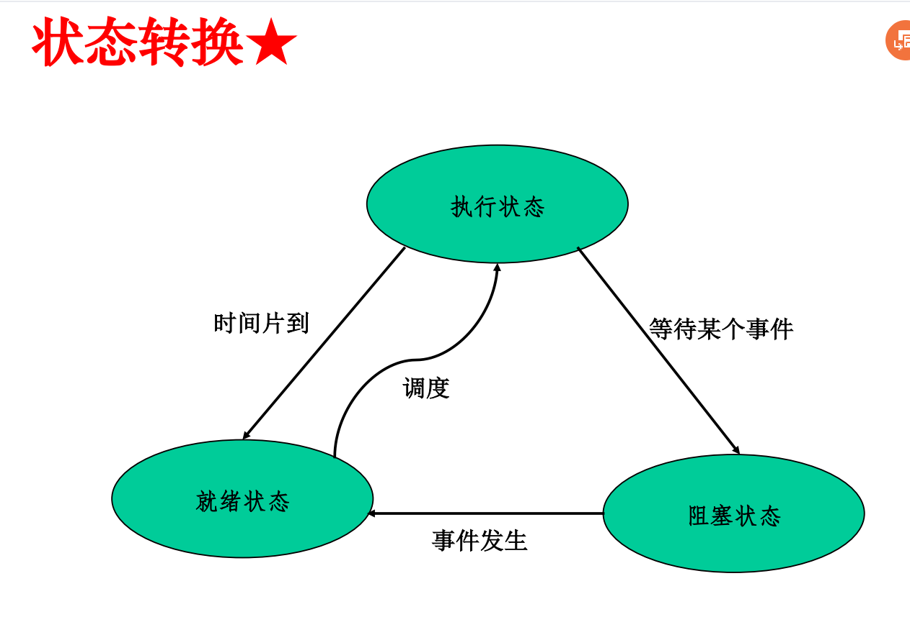

# 进程与线程


## 目录

```
进程概念
进程状态与控制
线程概念
线程实现方式
```


## 索引与重点

### 进程概念

**并发与并行**P3：并行属于并发

顺序执行和并发执行的顺序

竞争P10

Bernstein条件P11

**进程定义、和程序的区别**P18：进程=程序+数据，动态、并发、独立、异步

**进程组成**P20：程序、数据、PCB

**进程与程序区别**P22：动态静态、暂时永久、组成、对应关系

### 进程状态与控制

**进程原语**P30

forkP32：父进程返回子进程ID，子进程返回0

**进程状态**P34：就绪、执行、阻塞



进程控制块PCB：P40

进程上下文切换vs陷入内核P46

### 线程概念

P52:**并发执行、共享地址空间，资源与计算分离、节省切换开销**

引入进程、线程好处P57

每个线程有自己的栈

**进程VS线程**P64

### 线程的实现方式

用户级线程P4：使用库模拟

POSIX PthreadsP7

用户级线程优缺点P8

内核级线程P9，优缺点P11

混合的线程实现方式P13

三种线程实现方式对比P15

三种线程模型（many-to-one，one-to-one，many-to-many）P16

线程安全P23：不同执行顺序、无需同步或调用方操作都可以获得正确结果，则线程安全

可重入不一定线程安全，线程安全不一定可重入

可重入代码PPT6P11：并发调用可安全运行，不使用全局、静态变量、不能修改代码本身、不能调用其他不可重用代码


## 小测题

引用全局变量可以是线程安全

引用静态变量可以是线程安全


