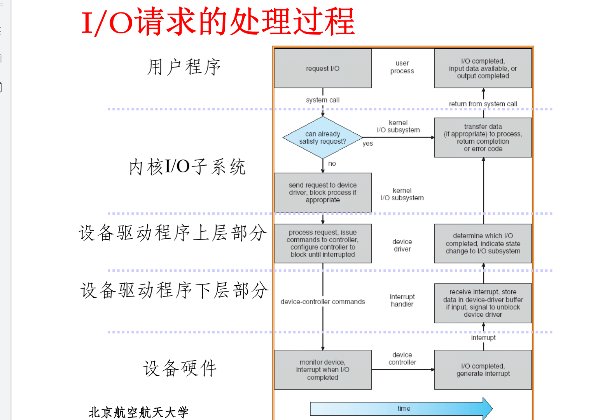

# 设备管理


## 目录

```
IO管理概述
IO硬件组成
IO控制方式
IO软件组成
IO缓冲管理
IO设备管理
IO性能问题
```


## 索引与重点

### 概述

IO管理目的P4：提高效率、方便使用、方便控制

功能：用户接口、设备分配释放、设备访问控制、IO缓冲和调度

总线P13

CPU-内存 <=> 接口适配器 <=>设备控制器 <=> 外部设备

软件角度P15：控制设备的控制寄存器、数据寄存器、状态寄存器。

IO设备管理包括逻辑IO、设备驱动】中断服务

**IO设备分类**P17：字符设备（字符为单位，传输速率低，不可寻址）、块设备（数据块，速率高，可寻址）、网络设备

资源分配角度P18：独占设备、共享设备、虚设备

IO目标任务P19：完成用户IO请求（分配回收、驱动、中断、缓冲区管理）、提供方便统一的用户接口、充分利用CPU和设备并行工作能力、保护设备数据

### IO硬件组成

设备控制器P24：功能、组成（与CPU接口、与设备接口、IO逻辑）


**IO端口地址**P26：每个寄存器有唯一地址，所有IO端口地址形成IO地址空间,,氛围内存映像编址和IO独立编址

内存映射编址特点P27：不需要特殊保护机制、可使用访存指令访问。不允许高速缓存

IO独立编址特点P28：不占用内存空间，易于区分内存和IO操作。指令少，操作不灵活

### IO控制方式

**程序控制IO** P32 P33：轮询忙等

**中断驱动**P35 P36：记录在设备记录表并启动其他进程，IO结束后通知驱动程序恢复进程

**DMA**P39：设置DMA寄存器，由DMA控制器完成传输，全部完成后发出中断。优点：CPU无需控制中间过程，适于高速设备。缺点：控制数据方向地址占用CPU时间，需要新增DMA控制器

中断与DMA区别P42：成批数据中断、CPU干预、异常事件处理

**通道**：特殊处理器专门负责传输，有专门的的通道指令，与CPU并行。减少CPU干预，但费用较高

通道种类P45：字节多路通道、数组选择通道、数组多路通道

通道与DMA区别P47：独立控制、可同时控制多种设备

### IO软件组成

**分层设计**P49：每层执行OS功能子集，依赖于低层功能，向高层提供服务。低层考虑硬件，高层提供接口


**设备独立性**P53：逻辑设备转化为物理设备。用逻辑设备请求，物理设备实际执行。

设备独立性优点：分配灵活、易于IO重定向

逻辑设备表P55：逻辑设备名、物理设备名、驱动程序入口地址

设备驱动程序P57：接受设备无关的软件请求并执行，在IO进程与设备控制器之间通讯，与IO设备、控制方式密切相关

设备驱动组成P59：初始化子程序、IO操作子程序（系统调用）、中断服务子程序

设备驱动共性P60：核心代码、核心接口、核心机制与服务、动态可加载、动态性

驱动程序接口P61：初始化函数、卸载函数、申请释放设备函数、IO操作函数、中断处理函数

IO请求处理过程P62



驱动与应用程序区别P63：main函数、标准C库、执行时机

### IO缓冲管理

缓冲技术P65：提高外设利用率。匹配CPU与外设不同处理速度，减少中断次数，提高CPU和外设并行性

**单缓冲**P66：T输出，M传送，C处理

每一块数据处理时间为Max(C,T)+M


**双缓冲**P67：每一块处理时间为Max(C,T)


环形缓冲P68：多个缓冲区，分为空缓冲区R、满缓冲区G和正在使用的工作缓冲区C


缓冲池P70：可供多个进程共享


### IO设备管理

设备控制表DCT P77

控制器控制表COCT、通道控制表CHCT P79

系统设备表SDT P80

设备分配考虑因素P81：固有属性、分配算法、安全性（同步安全分配阻塞，异步不安全分配可继续请求其他IO设备发生死锁）

单(多)通路IO系统的设备分配P82：分配设备、分配设备控制器、分配通道

### SPOOL技术ing

P83：虚拟设备技术，把独享设备变成共享虚拟设备，提高设备利用率，引入假脱机程序

SPOOLing和外设进行实际IO

应用只与SPOOLing进行虚拟IO，送入缓冲池，缓冲池与外设IO


输入井输出井：磁盘上存储空间，暂存IO数据

缓冲区：CPU与磁盘间缓冲

SPOOLing特点P88：告诉虚拟IO，实现独享设备共享

### IO性能问题

IO操作过程P93

阻塞IO P94：挂起当前进程

IO多路复用P96：阻塞在多个进程

非阻塞IO P98：进程立即进行别的操作

事件驱动IO P99

异步IO P100

五种模型比较P101


## 小测题

双缓冲条件是CPU和IO速度相近