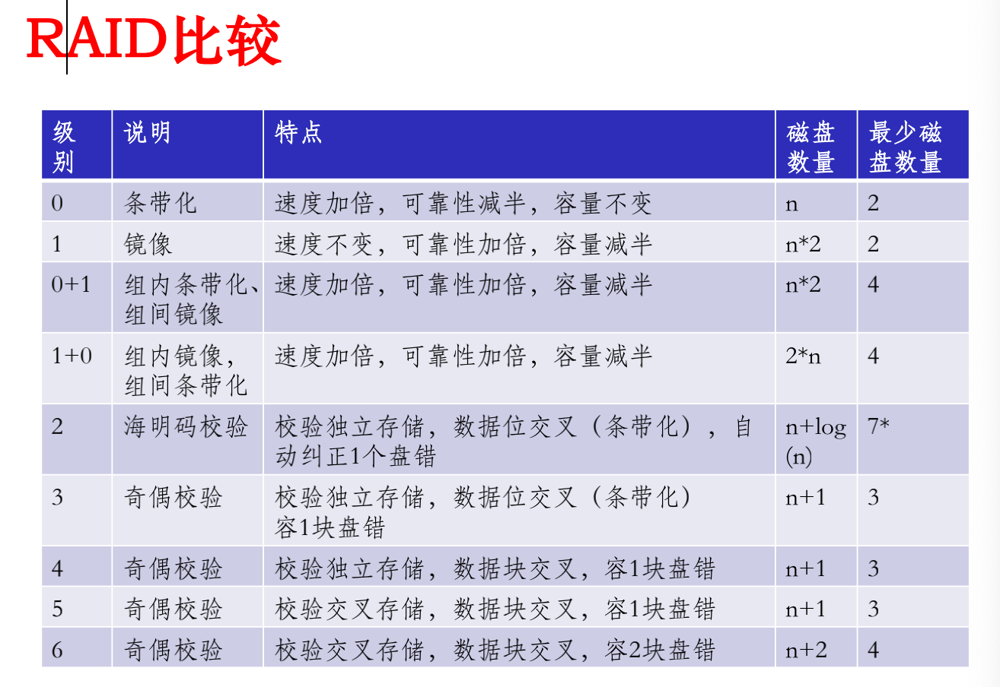

# 设备管理


## 目录

```
磁盘存储工作原理
磁盘IO性能
磁盘可靠性
磁盘管理实例
```


## 索引与重点

### 磁盘存储工作原理

P8

扇区：盘片分成的扇形区域

磁道：盘片为中心不同半径的同心圆

柱面：不同盘片同半径磁道组成的圆柱

每个磁盘两个面，每面一个磁头

P10：读扇区需要柱面、磁头、扇区三个参数，一维逻辑块数组按顺序映射到磁盘的扇区

### 磁盘IO性能

寻道时间P14：Ts=启动磁盘时间s+磁道数n*磁头移动时间m

旋转延迟时间P16：Tr=1/(2r)，r为转速

传输时间P17：Tt=b/(rN)，r为转速，b为读写字节数，N为磁道上字节数

### 磁盘调度算法

FCFS：简单公平。效率低

SSTF：选择离当前磁头最近的请求。时间短。有饥饿现象

SCAN：既考虑距离也考虑方向。避免饥饿，性能好。两侧磁道访问频率低

C-SCAN：到达最右后立即回到最左，消除对两侧请求的不公平

LOOK、CLOOK：当前方向无请求则反向

### 提高IO速度途径

选择性能好的磁盘、并行化、调度算法、高速缓存、消除文件碎片

缓存P33：独立/以虚拟内存作为缓存、数据交付、置换算法、周期性写回

优化数据布局P34：优化物理块布局、优化索引节点布局

提前读、延时写、虚拟盘P35

Flash Disk专题 NAND NOR P36

### RAID

冗余提高可靠性，并行提高性能

优点：成本低、功耗小、传输速率高，可提供容错功能

数据分段并行交叉存取P49：分为条带写到多个磁盘

RAID0：两个盘一组并行交叉存取

RAID1：每个数据重复存入镜像盘，读性能好，写性能由最差磁盘决定，可靠性好，成本高

RAID0+1、RAID1+0 P53：先分块后镜像、先镜像后分块。RAID1+0容错能力更强（前者坏一块导致整个条带失效）

RAID2：海明码纠错，数据位交叉写入，**按位条带化**。并行存取，传输率高，冗余磁盘数量正比于log(数据磁盘数量)

RAID3：奇偶校验，数据位交叉，只有一个校验盘。字节级别条带，读写访问所有盘。恢复时间长，读写性能水桶效应

RAID4：奇偶校验，数据块交叉，只有一个校验盘。随机读快，随机写慢（竞争校验盘），冗余代价与RAID3相同，

RAID5：奇偶校验，数据块交叉，分布冗余校验，数据和校验分布在各个磁盘

RAID6：奇偶校验，数据块交叉，两个分布冗余校验，容忍双盘出错，存储开销是RAID5两倍

条带化：一个字节块放在多个数据盘上。并行存取性能好，负载均衡。可靠性低，IO请求需要排队

镜像：数据拷贝。可靠性高。存储开销大

校验：通过运算校验正确性。可靠性高，可快速恢复。开销大




## 小测题

2. 以下说法正确的是：

A. 磁盘比磁带具有更大的容量

B. 磁盘比磁带具有更好的随机访问性能

C. 硬盘通常可以实现存储介质和驱动器分离

D. 一个硬盘的多个磁头彼此可以独立寻道

答案：B


设一个硬盘的转速为 7200RPM，则其平均旋转延迟为：4.17ms（1/(2*7200/60)）

假设磁盘平均损坏时间是 100000 小时，采用 2 块这样磁盘组成 RAID 0 阵列，其平均损坏时间是：50000小时


某磁盘的旋转速度为 7200RPM，平均寻道时间为 6ms，每磁道存储 1MB 数据。如果数据块大小为 4KB，则读取一块数据时，数据平均传输速率约为：392 KB/s

4K/(6+4.17)