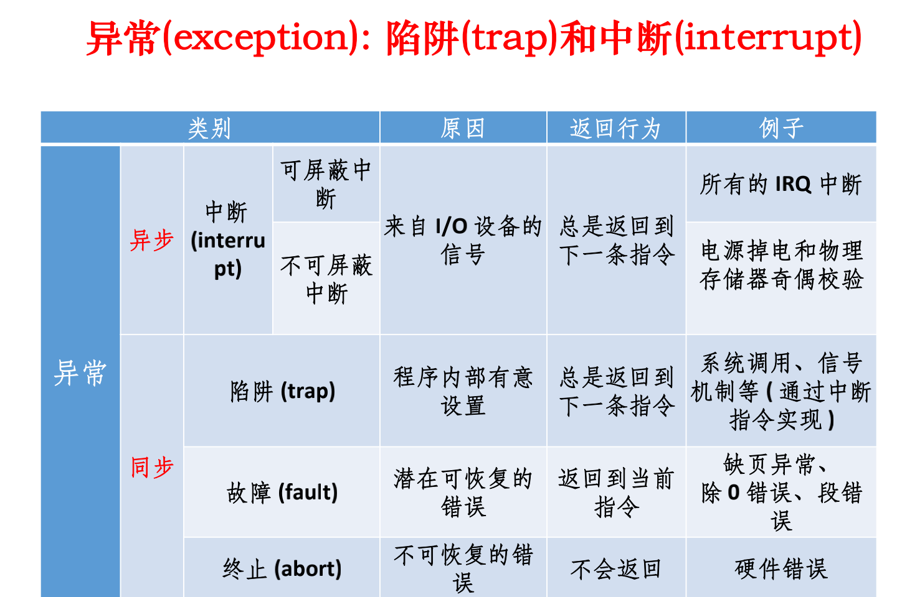

# 引论


## 目录

```
什么是操作系统
操作系统简史
计算机硬件简介
操作系统的基本实现机制
操作系统的基本类型
操作系统的特征和功能
操作系统结构
目前常用操作系统的介绍
```

## 索引与重点

### 操作系统简史

操作系统定义P19：操作系统是一组管理计算机硬件资源的软件集合，它向计算机程序提供共性的服务

抽象易于使用、资源有效利用、改善性能

批处理系统P41：自动地、成批地处理一个或多个用户的作业（包括程序、数据和命令）

联机批处理P43：主机忙等

脱机批处理P44：增加卫星机用于IO，主机空闲

多道程序P48：多个程序同时放入内存，交替在CPU中运行，提高利用率

宏观并行微观串行

多道批处理系统P54：吞吐量大利用率高，周转时间长不能交互

分时系统P56：分配时间片，支持多用户多进程，交互性、独立性、及时性、多路性

网络系统、分布式系统P78

实时系统P80

### 计算机硬件简介

存储结构P89、磁盘P94

IO设备P95：IO方式忙等、中断、DMA

### OS基本实现机制

**中断异常trapP100、P101**



### OS基本类型

批处理、分时、实时、混合型

### OS特征和功能

特征P110：并发、共享、虚拟、异步性

功能P111：CPU管理（进程管理）、内存管理、设备管理、文件管理、作业控制

具体功能P112-P116

### OS结构

模块接口、有序分层法、虚拟机、微内核结构、机制与策略分开P119

微内核：可移植性好、配置灵活、适应分布性环境，切换开销大、速度慢


## 小测题

分时系统相比批处理系统主要开销是：系统切换

DOS属于：网络操作系统

负责管理寄存器：编译系统

一个扇区通常有多少字节：512


## 第一次作业

1、假如没有操作系统，怎样控制硬件？

2、计算机系统中不同层次接口的作用？

3、冯诺依曼计算机的主要特点是什么？


### 第二次作业

多道程序并发执行、利用率、周转时间等


