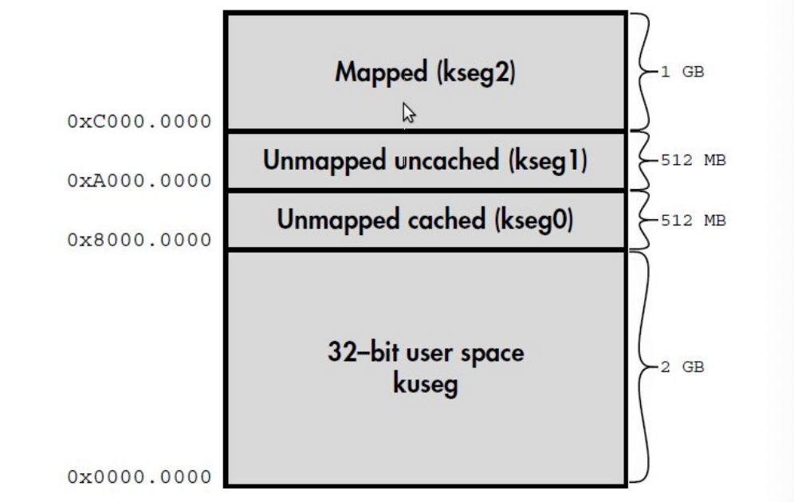
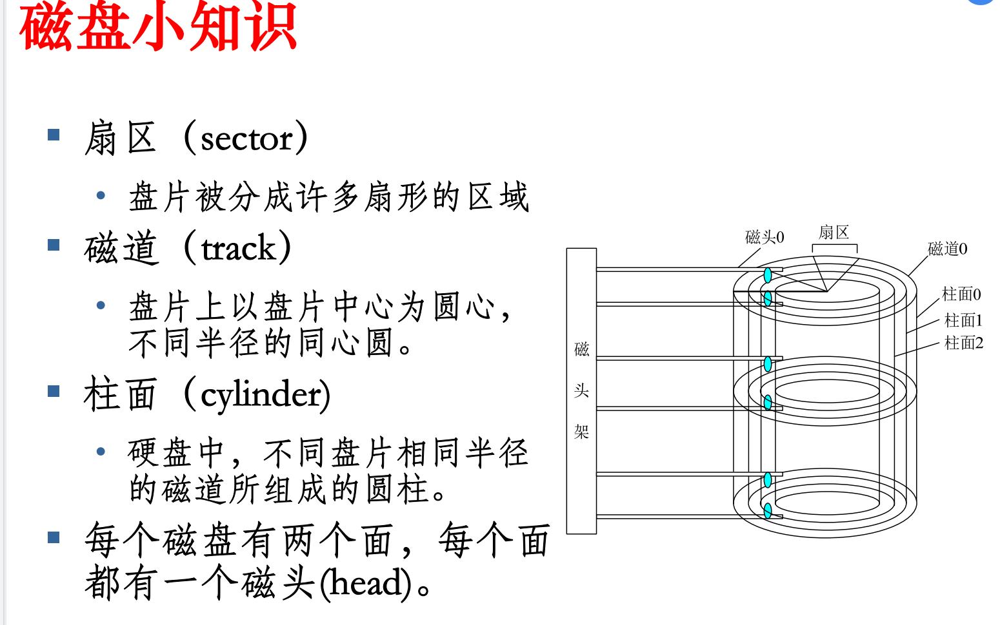

# Boot

```
启动的内容不是很好考，所以大家了解过程就可以了。
																					——王雷
```


## 目录

```
MIPS启动
MIPS下Linux引导
X86启动
X86下Linux引导
```

## 索引与重点

BootloaderP4、P42：先于OS运行，依赖硬件

Booter：初始化硬件，部分运行，汇编实现

Loader：加载OS映像至内存，跳转至OS代码，C语言实现

MIPS内存空间



kuseg：用户态可用地址，需MMU转换

kseg0：最高位清零映射至物理地址，不需要MMU，需要cache

有MMU系统将OS内核放在kseg0，无MMU系统将多数程序数据放在kseg0

kseg1：高三位清零映射至物理地址，不需要MMU，不需要cache，**Boot使用**

kseg2：内核使用，需要MMU

MIPS启动过程P13、P16

X86启动过程：BIOS/UEFI、MBR

**磁盘**P32：



LINUX：GRUB、LILO

主引导扇区MBR：整个硬盘第一个扇区

引导扇区Boot Sector：每个分区第一个扇区

内核镜像P51：资源管理（内存、进程、设备）、用户服务（系统调用）

## 小测题

bootloader支持不同CPU架构、不同OS启动√

MIPS重启时正常工作地址空间：kseg1


栈区：自动分配释放局部变量

data段：已初始化的全局变量和静态变量

bss段：未初始化的或者初始化为0的全局变量和静态变量

堆：程序员分配释放