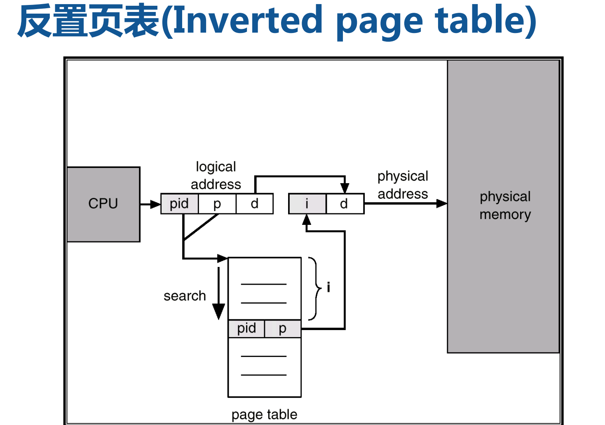

# 页式内存管理


## 目录

```
基本原理
基本概念：页表、地址转换、多级页表、TLB
页表类型：哈希页表、反置页表
页共享与保护
页目录自映射
```


## 索引与重点

作业进程和程序P4

分区内存问题P5

分页基本思想[6：连续程序存放到不连续内存区域内

纯分页/基本分页vs请求分页P9：所有页一次装入内存。没有外碎片，内碎片小，便于改变程序内存大小。缺点：一次全部装入。

### 基本概念

P10：页虚拟地址，页框物理地址，页表

页内偏移位数=log~2~(页大小)，页号位数=地址空间位数-页内偏移位数

页面大小优缺点P13：页面越大内碎片越多，页表占用内存少，换进换出速度提高

页表P16：记录内存分配情况、实现动态重定位。访问一个数据需要访存两次

MMU地址变换机构P18：比较页号和页表长度；

页表项位置=页表始址+页号*页表长度


### 多级页表

一级页表问题（多级页表动机）：**页表占用内存**。

二级页表：第二级页表动态调入

**二级页号位数=log~2~(页面大小/页表项大小)**

多级页表P26：各级页表记录的全是物理页号

### TLE

TLB动机：**访存效率降低**

TLE命中：一次访存，缺失时两次访存

TLB缺失时将页表项复制到TLB，若已满则按策略替换

内存访问时间EAT P38

### 哈希页表

P40：虚页号->哈希表号->顺着链表检索

### 反置页表

动机P42：进程过多、页表项过多消耗内存

减少内存，但查找页表项慢，难以共享内存

进程号、物理页号->虚拟页号



与哈希表组合P46、P47

难以共享内存，每个物理页只对应一个虚拟页

### 页共享与保护

共享P48

保护P50：地址越界、保护位（只读、读写、执行）

### 页目录自映射

页目录的1024项逻辑上连续，物理上分散。每个页目录相对应4MB内存，共对应4GB内存

页目录为1024个4KB页表中的一个

页目录中有一项（4B）指向页目录基地址

给定页表基址PTbase，页目录基址**PDbase = PTbase|PTbase>>10**

先右移22位找到对应的4MB空间是第几个，再左移12位得到对应的4KB空间是第几个

（或右移12位找到对应的4KB空间是第几个，再左移2位得到对应的4B页表项是第几个

=PTbase*（1+1/1024）

自映射目录项**PTE~self-mapping~ = PTbase|PTbase>>10|PTbase>>20**

页目录自映射是**虚拟空间内的映射**

推广到48位：P33

## 小测题

页式内存导致进程间共享数据不方便

假设虚拟地址有64位，页面大小为4KB字节，一个页表项占8个字节。如采用一级页表，页表需占用多少内存？ 2^55 字节

一个32位页式内存管理系统，页面大小是4KB，采用二级页表管理，页表被映射到起始地址0xC000_0000的4MB地址空间，如果需要将虚拟地址0x8001_0000映射到物理地址0x0000_0000上，则需要修改虚拟地址0x____________________上的页表项：（填空）
答：C0200040

此题的问法相当于问虚拟地址0x8001_0000所在页的页表项在哪里。每4KB一页，则0x8001_0000所在的页是0x8001_0000 / 4K = 0x80010，第0x80010个页，每个页占用4B的页表项，则该页所在页表项在页表中的偏移是0x80010 * 4B = 0x200040，页表起始地址为0xc000_0000，则该页表项的地址为 0xc000_0000 + 0x200040 = 0xc020_0040。

### 第四次作业

位图和链表存储

四种分区分配算法

逻辑地址、物理地址、地址映射概念

页表、块表概念与目的